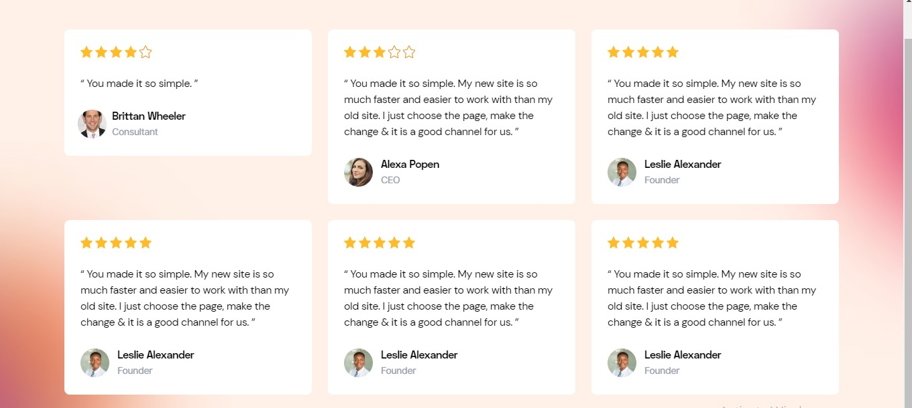
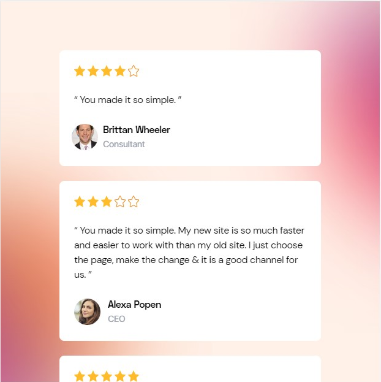
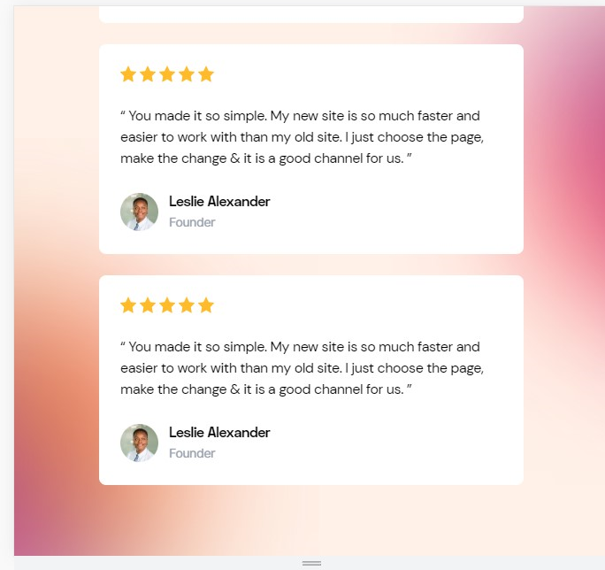

# Laravel Technical Assessment

Welcome to the Aire Labs technical interview! We were very impressed by your application, and wanted to invite you to complete a short technical assessment to make sure you would be a good fit for this role.

## Instructions

This repository has boilerplate code for a Laravel project, as well as some graphics assets. 

Clone this repository and name it "RaphAlemoh-aire-labs-laravel-technical]". Then, using Livewire, please implement [this design](https://www.figma.com/file/n9fw5W1l4S7FyyV7qadnW2/Technical-Assessment?type=design&node-id=0%3A1&mode=design&t=YjDVnlWZmevfQ8JU-1).

When you are finished, email us the link to your repo with the subject "[Your Name] Aire Labs React Technical Assessment Completed".

## Grading

We are grading based on:

* [ ] Code structure
* [ ] Accuracy to the Figma
* [ ] Responsiveness

# How to setup project locally
```
    The project can be setup locally by running the following commands
```

    - composer install

    - cp .env.example .env

    - php artisan key:generate

    - npm install

    - npm run dev

    - php artisan serve

# project finalization screenshot


# Desktop View


# Mobile view




